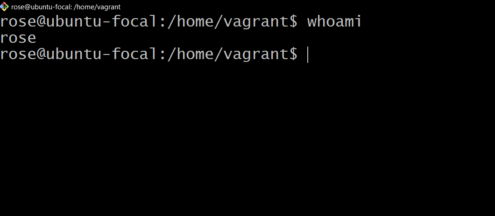
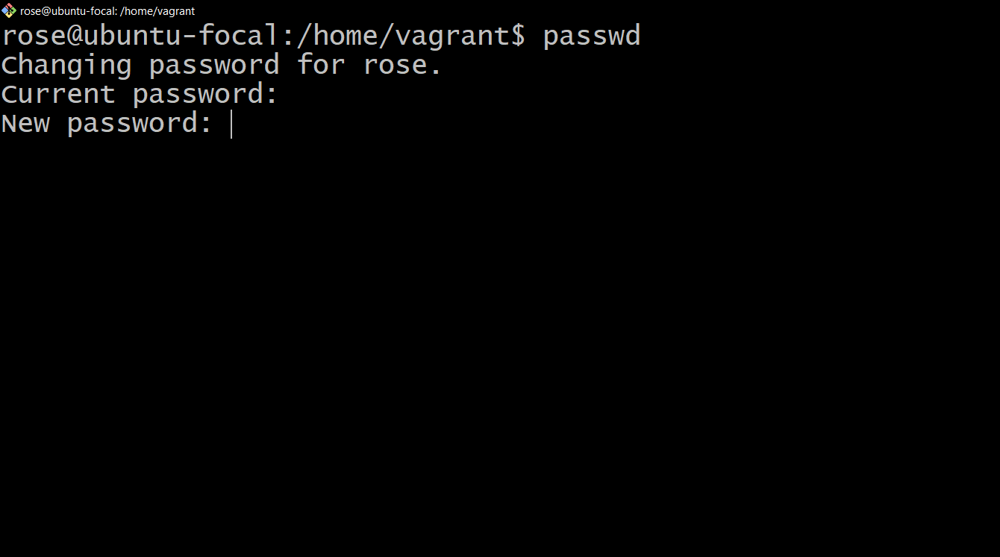
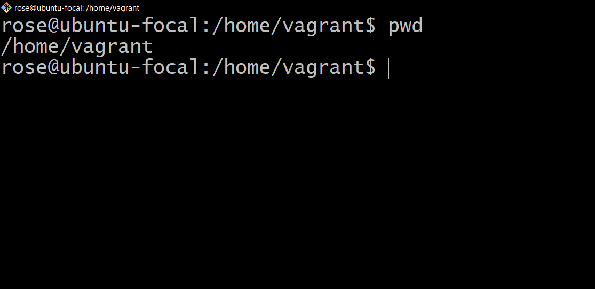
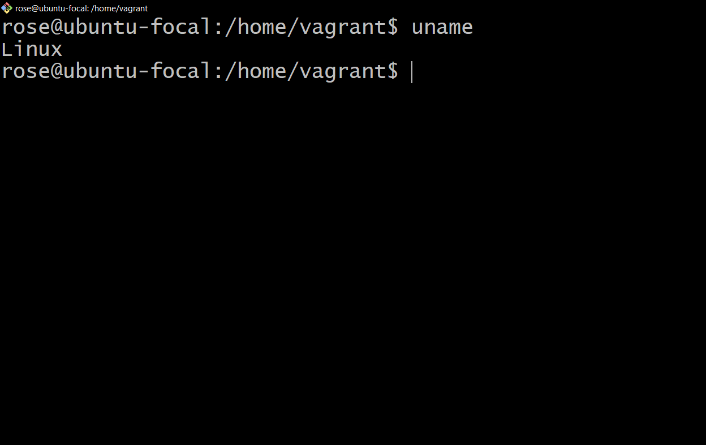
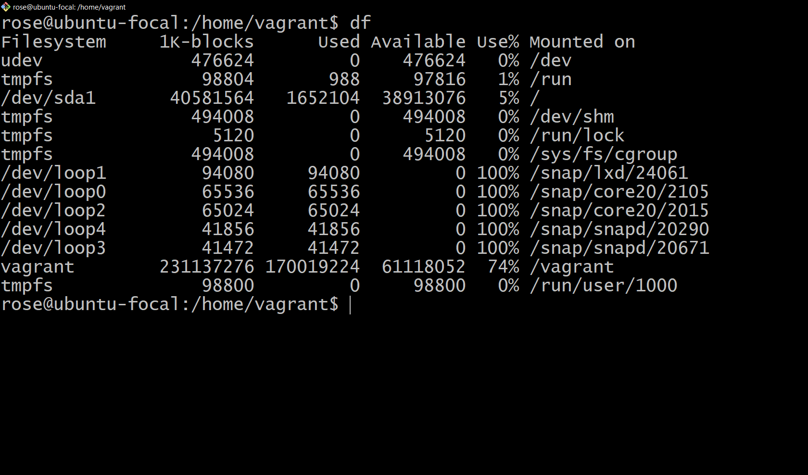
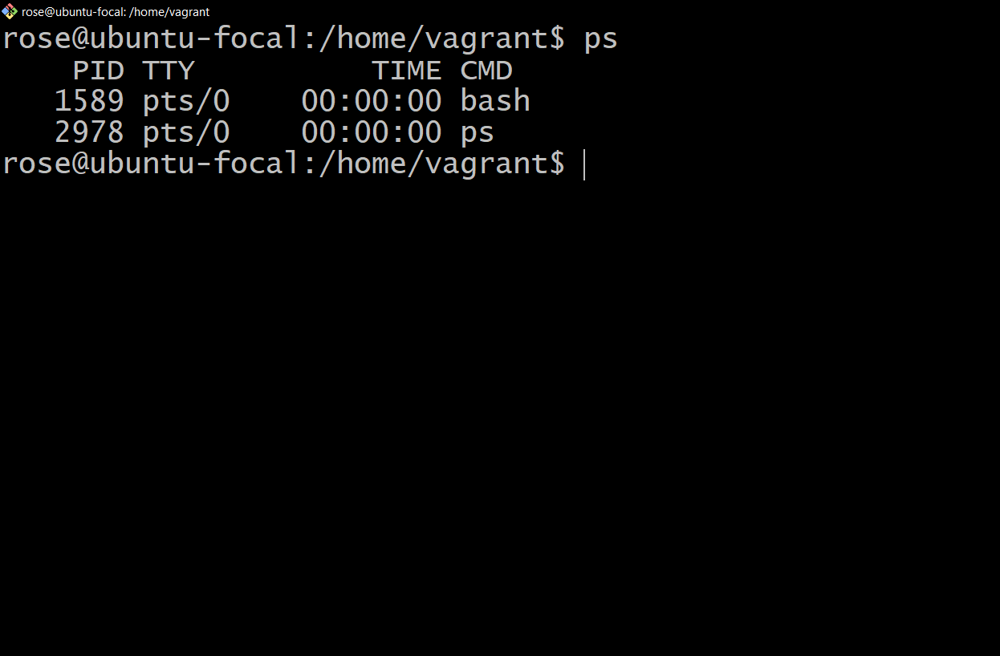
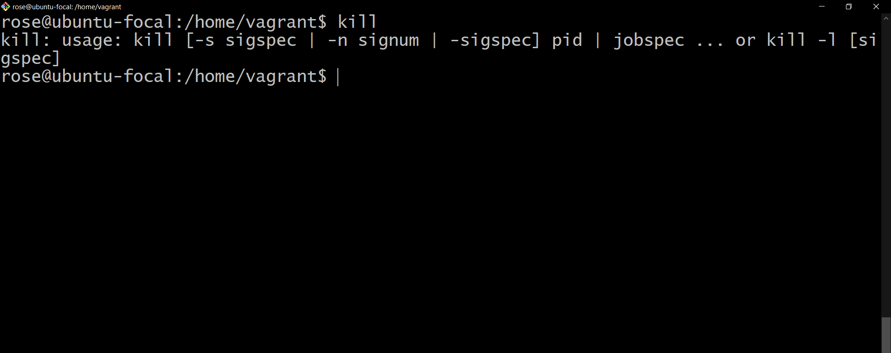
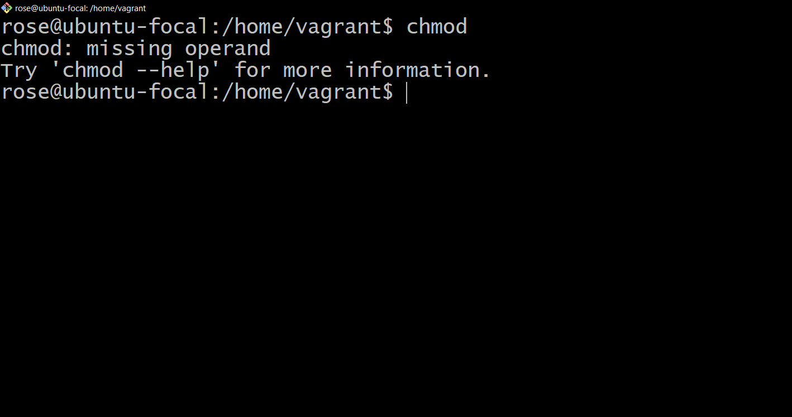
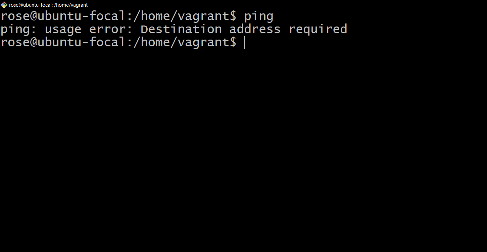
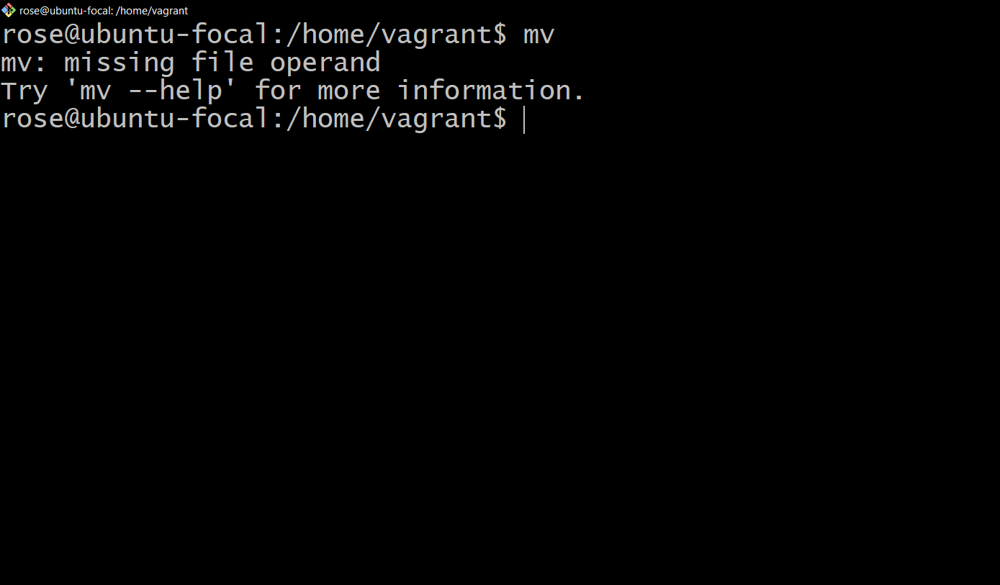

# List of my 10 linux command
1. `whoami` this command shows the current user

2. `passwd` this command is used to change user password

3. `pwd` this command print current working directory

4. `uname` this command print system information

5. `df` this command display disk space usuage

6. `ps` this command display information about processes

7. `kill` this command is used to terminate a process

8. `chmod` this command changes file permission

9. `ping` this command is used to test network connectivity

10. `mv` this command is used to move or rename file or directories
